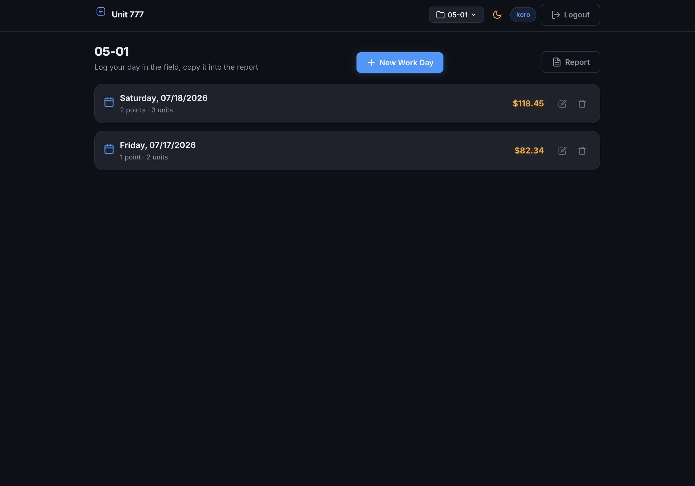
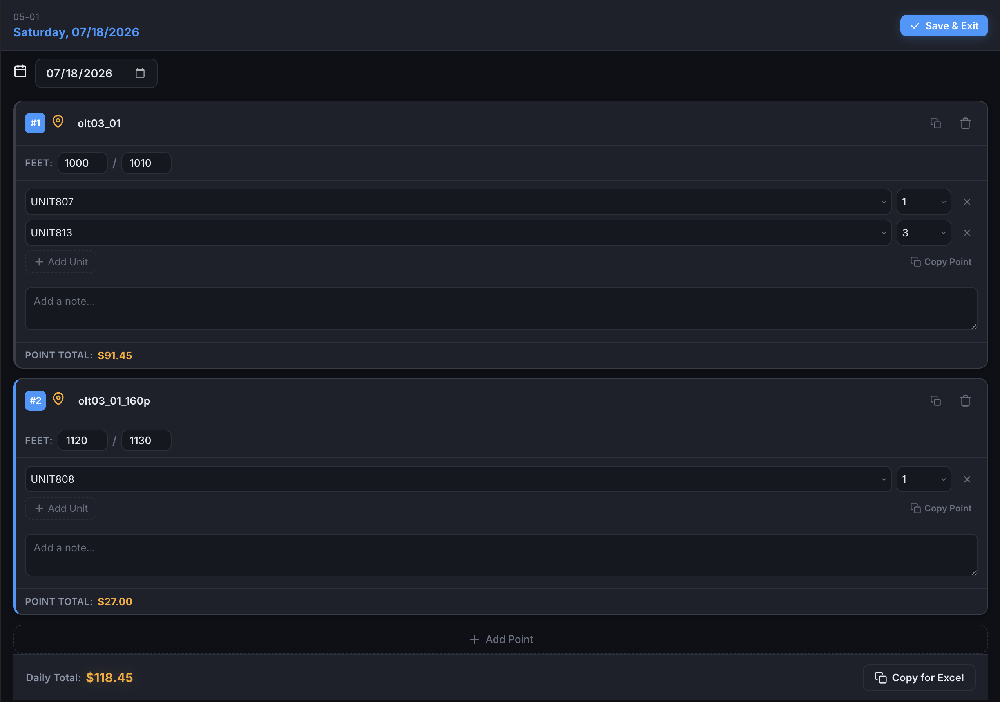
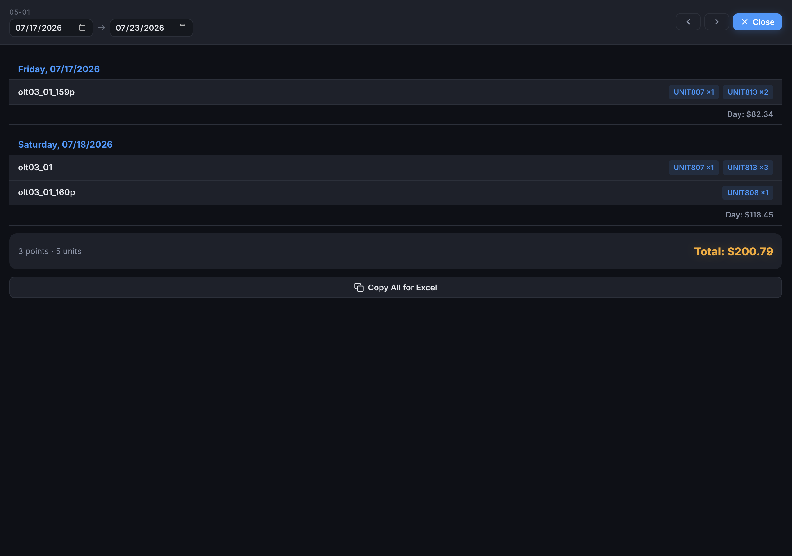
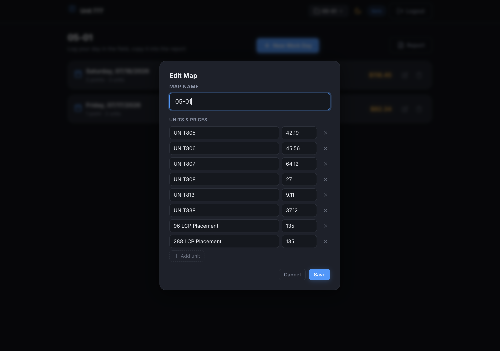
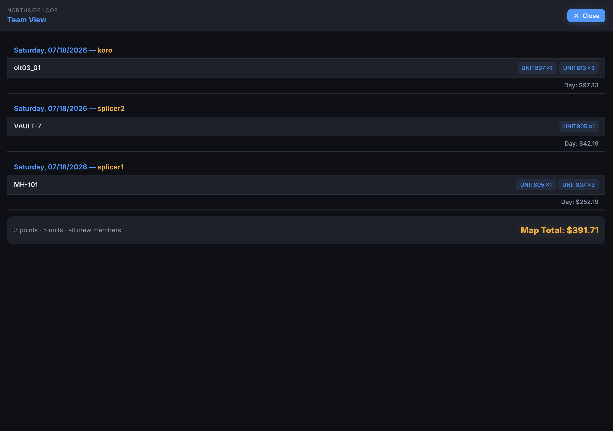

# Fiber Field-Reporting Platform ("Unit 777")

A web platform I built during a fiber-optic splicing internship to fix a real reporting problem: a ~50-person field team was losing **3–5 hours every week** manually compiling reports from phone notes, Google Sheets, and marked-up PDF maps. With this tool, weekly report prep dropped to **under 1 hour**. I handed it off to the team to own after the internship ended.



## The workflow it supports

A splicer works from a PDF communications map showing manholes and handholes, each labeled by name. At every point they physically visit, they pull the required cable, feed it into a terminal, and read the fiber-footage markings on the cable before it enters and after it exits.

In the tool, for each point the splicer records:

- **Fiber-feet in / out** — the before- and after-terminal footage readings
- **Work units** completed at that point, chosen from the map's unit list
- An optional **note**



Everything exists to make reporting fast:

| Action | Output |
|---|---|
| **Copy Point** | Plain-text summary (name, units, feet, note) to paste into the PDF when preparing redlines |
| **Copy for Excel** | The whole day as TSV, pasted straight into the Excel report |
| **Report** | Review any date range (defaults to the crew's Friday→Thursday reporting week) and copy it all for Excel |



## Features

- **Work log** — days → points → units, optimized for one-handed phone use in the field
- **Shared map catalog** — maps and their unit price lists are shared across the crew; when adding a map you pick from ones teammates already created (newest first), which keeps names consistent and reports mergeable
- **Per-map unit & price editor** — each map defines its own work-unit list and rates; prefilled from your previous map. Edits apply retroactively to every total, and a unit that's already used in recorded work can't be deleted
- **Team view** — read-only view of what every crew member logged on a map, newest days first
- **Date-range reports** — Friday→Thursday by default (reports were due Thursdays — the report button pulses on Thursdays), with manual from/to selection for any interval
- **Earnings tracker** — per-splicer monthly and weekly totals, since pay was per unit
- **Point-name autocomplete** from your own history, dark/light theme, multi-user accounts (JWT + bcrypt)

| Map editor | Team view |
|---|---|
|  |  |

## Stack

**Node.js + Express · SQLite (better-sqlite3) · vanilla JS (ES modules) · no build step**

Deliberately boring choices for a tool scoped, built, and shipped over one weekend:

- SQLite is a single file — nothing to provision, trivial to back up, more than enough for a 50-person crew
- No frontend framework and no bundler — the entire client is ~1,200 lines of ES modules served statically
- All dynamic rendering builds real DOM nodes (no HTML-string interpolation), so user input can't inject markup; all queries are prepared statements; every route checks row ownership
- Maps and their unit lists are shared crew-wide; work days are personal. Recorded work references unit definitions by id instead of copying name/price — which is why a price edit retroactively updates every total and report

## Running it

```bash
npm install
npm start          # http://localhost:3000
```

Optional configuration via environment (see `.env.example`): `JWT_SECRET` (random per start if unset — sessions reset on restart) and `PORT`.

The SQLite database is created automatically in `data/` on first run.

## Project structure

```
server.js            Express bootstrap
db.js                schema + prepared statements + composite queries
routes/
  auth.js            register/login, JWT middleware
  maps.js            shared catalog, unit editor, subscriptions, team view
  workdays.js        days, points, recorded units
  reports.js         date-range reports, earnings stats
public/
  index.html         views, modals, SVG icon sprite
  style.css
  js/                ES modules: state, api, ui, workday, maps, report, main
```

## What I'd improve next

Ideas I sketched while still working with the crew, roughly in order of complexity:

1. **Roles** — foreman/admin vs. splicer, instead of today's trust-based shared editing of maps and prices
2. **Offline mode** — in remote settlements coverage is often too poor to rely on; entries should queue locally and sync when the signal returns
3. **Photo evidence** — attach photos of the finished splice to a point's report, alongside the text of what was done
4. **Plan ingestion** — the client's engineering plan is a 30–100 page PDF where each splice point's table tells you which fiber of which cable goes where; every splicer currently decodes this by hand, off the clock, with room for error. Split the plan into pages and have a multimodal LLM parse each one into structured per-point instructions (my early experiments feeding plan screenshots to LLMs were promising). The splicer would still get the original plan page next to the parsed instructions — the responsibility for the splice stays with the human
5. **Work dispatching** — once points and their payouts are in the database, an agent could hand them out: a fair mode that balances earnings across the crew, and an urgent mode that routes the long, expensive points to the fastest splicers — all feeding the same billing report

## License

[MIT](LICENSE)
